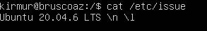
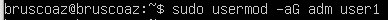
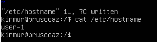
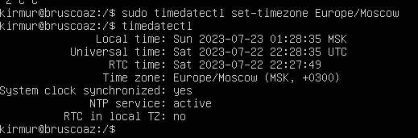
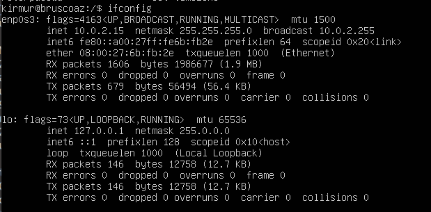
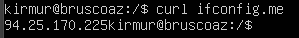
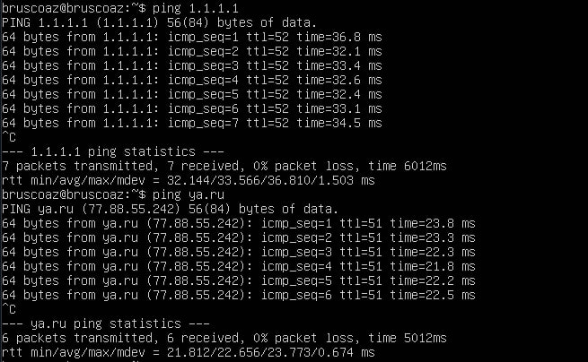
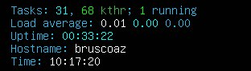

## Part 1. Установка ОС

- Вывод команды `cat /etc/issue`:

## Part 2. Создание пользователя

- Добавление пользователя:

- Выполнение команды `cat /etc/passwd`:

- Добавление пользователя в группу __`adm`__:

## Part 3. Настройка сети ОС

- Измнение пользователя на __user-1__:

- Установка временной зоны(Мск):

- Названия сетевых интерфейсов:

- lo - используется по умолчанию и нужен для отладки сетевых программ и запуска серверных приложений на локальной машине.

- __DHCP__:

- DHCP - Dynamic Host Configuration Protocol. Сетевой протокол, позволяющий сетевым устройствам автоматически получать IP-адрес и другие параметры, необходимые для работы в сети TCP/IP.

- IP(Внешний):

- IP(Внутренний):

- Статический IP(Настройка):

- Статический IP(Проверка после перезапуска машины):

## Part 4. Обновление ОС

- Система обновлена:

## Part 5. Использование команды **sudo**

- Измененный hostname:

- Sudo — это выполнение команды от имени другого пользователя, обычно от root. 

## Part 6. Установка и настройка службы времени

- Вывод команды `timedatectl show`:

## Part 7. Установка и использование текстовых редакторов 

Содержимое файла перед закрытием __VIM__ с сохранением:

- Выход: `:wq` 

Содержимое файла перед закрытием __nano__ с сохранением:

- Выход: `CTRL+X + Y`  

Содержимое файла перед закрытием __joe__ с сохранением:

- Выход: `CTRL+K + X`

Содержимое файла перед закрытием __joe__ без сохранения:

- Выход: `CTRL+K + D`

Содержимое файла перед закрытием __nano__ без сохранения:

- Выход: `CTRL+X + N`

Содержимое файла перед закрытием __VIM__ без сохранения:

- Выход: `:q!`

Поиск по слову __VIM__:

- Поиск: `/on`

Замена слова __VIM__:

- Замена: `:s/on/schhol21` 

Поиск по слову __nano__:

- Поиск: `ALT+W 123` 

Замена слова __nano__:

- Замена: `ALT+R 21 11 ENTER` 

Поиск по слову __joe__:

- Поиск: `CTRL+K+F on + I(ignore)` 
 
Замена слова __joe__:

- Замена: `CTRL+K+F 21 + R(replace) hello` 

Замененное слово __joe__:

## Part 8. Установка и базовая настройка сервиса **SSHD**

- __SSH__ установлена:

- __SSH__ в автостарте при загрузке системы:

- Замена порта на __2022__ + проверка с помощью `netstat -tan`:

- Ключ `t` - показывает только TCP соединения
- Ключ `a` - показывает все сокеты
- Ключ `n` - вывод адреса в числовом формате

- __Proto__: Показывает тип протокола сетевого соединения.

- __Recv-Q__: Показывает количество пакетов данных, которые находятся в очереди на прием на сокете.

- __Send-Q__: Показывает количество пакетов данных, находящихся в очереди на отправку сокета.

- __Local Address__: Показывает локальный адрес (IP-адрес и порт) для данного сокета.

- __Foreign Address__: Показывает удаленный адрес (IP-адрес и порт), к которому установлено соединение.

- __State__: Показывает текущее состояние сетевого соединения.

- __0.0.0.0__: Во внешнем адресе - никто не подключался, в локальном - служба ожидает входящие сетевые соединения. 

 Поиск __SSH__:

- Команда `ps` выводит список текущих процессов на вашем сервере в виде таблицы, с которой можно удобно работать: сортировать, изменять количество колонок и прочие
- Ключ `a` - выбор всех процессов
- Ключ `u` - выбор всех процессов пользователя
- Ключ `x` - выбор всех процессов с комбинацией с `a`
- `grep ssh` - поиск процесса с названием `ssh`

## Part 9. Установка и использование утилит **top**, **htop**

- Вывод `top` с сортировкой по процессорному времени:

- Uptime - 16:23:26
- Количество авторизованных пользователей - 1
- Общая загрузка системы - 0
- Загрузка CPU - 0
- Загрузка памяти 3919.9Mb всего, 1757.5Mb - свободно, 206.1Mb используется, 1956.2Mb используется для кэша/буфера
- PID `63335` использует наибольшее процессерное время

Вывод `top` с сортировкой по памяти:

- PID `3334` использует наибольшее количество памяти

- Вывод `htop`:

- Вывод `htop` с сортировкой по __PID__:

- Вывод `htop` с сортировкой по __CPU__:

- Вывод `htop` с сортировкой по __MEM__:

- Вывод `htop` с сортировкой по __TIME__:

- Вывод `htop` отфильтрованному по по `sshd`:

- Вывод `htop` с процессом `syslog`:

- Вывод `htop` с `hostname`, `clock`, `uptime`:

## Part 10. Использование утилиты **fdisk**

- Вывод команды `fdisk -l`:

- Название - __sda__
- Размер диска - __30.44 GB__
- Количество секторов - __63815712__

## Part 11. Использование утилиты **df** 

- Выполнение команд `df` и `df -Th`:

- Отчет по команде `df`:

    - Размер раздела - __14560704 Kb__ (около 14Gb)
    - Размер занятого пространства - __6179900 Kb__ (около 6Gb)
    - Размер свободного пространства - __7519360 Kb__ (около 7Gb)
    - Процент использования - __45__

- Отчет по команде `df -Th`:

    - Размер раздела - __14 Gb__
    - Размер занятого пространства - __5.9 Gb__
    - Размер свободного пространства - __7.3 Gb__
    - Процент использования - __45__

## Part 12. Использование утилиты **du**

- Вывод размеров папок в Mb:

- Вывод размеров папок каждого вложенного элемента в Mb:

## Part 13. Установка и использование утилиты **ncdu**

- Установка __ncdu__:`sudo apt install ncdu`

- Размер папки __/home__:

- Размер папки __/var__:

- Размер папки __/var/log__:

## Part 14. Работа с системными журналами

- Просмотр __/var/log/dmesg__:

- Просмотр __/var/log/syslog__:

- Просмотр __/var/log/auth.log__:

- Время последней авторизации - `16:54:32`
- Имя пользователя - `kirmur`

- Перезапуск службы `ssh`:

    - `sudo systemctl restart sshd` - команда для перезапуска службы

## Part 15. Использование планировщика заданий **CRON**

- __CRON__ в  `log`:

- Скриншот текущих задач __CRON__:

