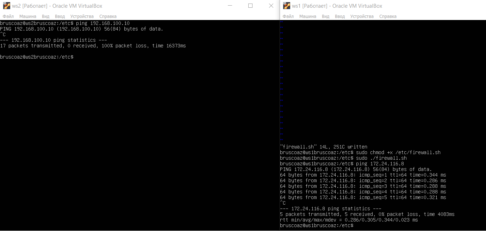
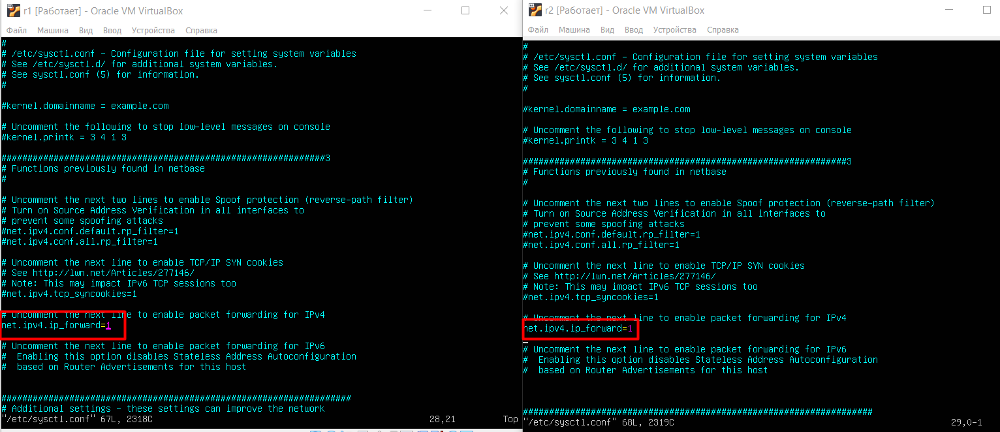
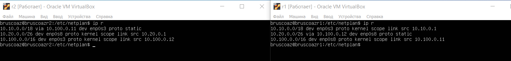

## Part 1. Инструмент **ipcalc**

**== Задание ==**

##### Поднять виртуальную машину (далее -- ws1)

#### 1.1. Сети и маски
##### Определить и записать в отчёт:
##### 1) адрес сети *192.167.38.54/13*


##### 2) перевод маски *255.255.255.0* в префиксную и двоичную запись, */15* в обычную и двоичную, *11111111.11111111.11111111.11110000* в обычную и префиксную


##### 3) минимальный и максимальный хост в сети *12.167.38.4* при масках: */8*, *11111111.11111111.00000000.00000000*, *255.255.254.0* и */4*


#### 1.2. localhost
##### Определить и записать в отчёт, можно ли обратиться к приложению, работающему на localhost, со следующими IP: *194.34.23.100*, *127.0.0.2*, *127.1.0.1*, *128.0.0.1*
Диапазон __localhost__: __127.0.0.1-127.255.255.254__
Можно обратиться:
- __127.0.0.2__
- __127.1.0.1__

Нельзя обратиться:
- __194.34.23.100__
- __128.0.0.1__
#### 1.3. Диапазоны и сегменты сетей
##### Определить и записать в отчёт:
##### 1) какие из перечисленных IP можно использовать в качестве публичного, а какие только в качестве частных: *10.0.0.45*, *134.43.0.2*, *192.168.4.2*, *172.20.250.4*, *172.0.2.1*, *192.172.0.1*, *172.68.0.2*, *172.16.255.255*, *10.10.10.10*, *192.169.168.1*

Диапазоны частных адресов:
- __10.0.0.0__ – __10.255.255.255__
- __172.16.0.0__ – __172.31.255.255__
- __192.168.0.0__ – __192.168.255.255__

К частным относятся: 
- __10.0.0.45__ 
- __192.168.4.2__
- __172.20.250.4__ 
- __172.16.255.255__ 
- __10.10.10.10__

К публичным относятся: 
- __134.43.0.2__ 
- __172.0.2.1__
- __192.172.0.1__ 
- __172.68.0.2__
- __192.169.168.1__


##### 2) какие из перечисленных IP адресов шлюза возможны у сети *10.10.0.0/18*: *10.0.0.1*, *10.10.0.2*, *10.10.10.10*, *10.10.100.1*, *10.10.1.255*

Диапазон возможных адресов:
- __10.10.0.1__ до __10.10.63.254__ 

Из перечисленных адресов у сети __10.10.0.0/18__ возможны:
- __10.10.0.2__ 
- __10.10.10.10__
- __10.10.1.255__

## Part 2. Статическая маршрутизация между двумя машинами

**== Задание ==**

##### Поднять две виртуальные машины (далее -- ws1 и ws2)

##### С помощью команды `ip a` посмотреть существующие сетевые интерфейсы

Команда `ip a` на ws1:


Команда `ip a` на ws2:


На обеих машинах имеем по одному конфигурируемому интерфейсу __enp0s3__.
##### Описать сетевой интерфейс, соответствующий внутренней сети, на обеих машинах и задать следующие адреса и маски: ws1 - *192.168.100.10*, маска */16*, ws2 - *172.24.116.8*, маска */12*


##### Выполнить команду `netplan apply` для перезапуска сервиса сети


#### 2.1. Добавление статического маршрута вручную
##### Добавить статический маршрут от одной машины до другой и обратно при помощи команды вида `ip r add`

Добавление статического маршрута через `ip r add`:


##### Пропинговать соединение между машинами

__Ping__ между __ws1__ и __ws2__:


#### 2.2. Добавление статического маршрута с сохранением
##### Перезапустить машины


Выполним команду `reboot` на обеих машинах.


##### Добавить статический маршрут от одной машины до другой с помощью файла *etc/netplan/00-installer-config.yaml*

Содержимое файла `00-installer-config.yaml` обеих машин:


##### Пропинговать соединение между машинами

__Ping__ между __ws1__ и __ws2__:


## Part 3. Утилита **iperf3**

**== Задание ==**

*В данном задании используются виртуальные машины ws1 и ws2 из Части 2*

#### 3.1. Скорость соединения
##### Перевести и записать в отчёт: 8 Mbps в MB/s, 100 MB/s в Kbps, 1 Gbps в Mbps

- __8__ __Mbps__ = __1__ __Mb/s__
- __100__ __MB/s__ = __800000__ __Kbps__
- __1__ __Gbps__ = __1000__ __Mbps__

#### 3.2. Утилита **iperf3**
##### Измерить скорость соединения между ws1 и ws2

На __ws1__ используем команду `iperf3 -s`, после этого машина начинает слушать, в этот момент с __ws2__ используем команду `iperf3 -c 192.168.100.10` и можем увидеть скорость соединения между __ws1__ и __ws2__.


## Part 4. Сетевой экран

**== Задание ==**

*В данном задании используются виртуальные машины ws1 и ws2 из Части 2*

#### 4.1. Утилита **iptables**
##### Создать файл */etc/firewall.sh*, имитирующий фаерволл, на ws1 и ws2:
```shell
#!/bin/sh

# Удаление всех правил в таблице "filter" (по-умолчанию).
iptables –F
iptables -X
```
##### Нужно добавить в файл подряд следующие правила:
##### 1) на ws1 применить стратегию когда в начале пишется запрещающее правило, а в конце пишется разрешающее правило (это касается пунктов 4 и 5)
##### 2) на ws2 применить стратегию когда в начале пишется разрешающее правило, а в конце пишется запрещающее правило (это касается пунктов 4 и 5)
##### 3) открыть на машинах доступ для порта 22 (ssh) и порта 80 (http)
##### 4) запретить *echo reply* (машина не должна "пинговаться”, т.е. должна быть блокировка на OUTPUT)
##### 5) разрешить *echo reply* (машина должна "пинговаться")

##### Запустить файлы на обеих машинах командами `chmod +x /etc/firewall.sh` и `/etc/firewall.sh`
Содержимое файлов `firewall.sh` на обеих машинах:


Запуск файлов:


__Ping__ обеих машин:





__Разница между стратегиями:__ 
- У утилиты __iptables__ правила выполняются сверху вниз, на машине __ws1__ идет сначала запрещающее правило, затем разрешающее, поэтому машина не пингуется, на машине __ws2__ сначала идет разрешающее правило, затем запрещающее, поэтому машина пингуется.

#### 4.2. Утилита **nmap**
##### Командой **ping** найти машину, которая не "пингуется", после чего утилитой **nmap** показать, что хост машины запущен
В выводе nmap должно быть сказано: `Host is up`

Использование утилиты __nmap__:


## Part 5. Статическая маршрутизация сети

**== Задание ==**

##### Поднять пять виртуальных машин (3 рабочие станции (ws11, ws21, ws22) и 2 роутера (r1, r2))

#### 5.1. Настройка адресов машин
##### Настроить конфигурации машин в *etc/netplan/00-installer-config.yaml* согласно заданию.

Содержимое файлов `00-installer-config.yaml` на машинах:


  

##### Перезапустить сервис сети. Если ошибок нет, то командой `ip -4 a` проверить, что адрес машины задан верно. Также пропинговать ws22 с ws21. Аналогично пропинговать r1 с ws11.

Перезагружаем сервис сети с помощью команды `sudo netplan apply` на каждой машине.

Команда `ip -4 a` на машинах:


__Ping__ `ws21` и `ws22`:


__Ping__ `r1` и `ws11`:


#### 5.2. Включение переадресации IP-адресов.
##### Для включения переадресации IP, выполните команду на роутерах:
`sysctl -w net.ipv4.ip_forward=1`

Выполнение команды `sysctl -w net.ipv4.ip_forward=1` на `ws11` и `ws22`:


##### Откройте файл */etc/sysctl.conf* и добавьте в него следующую строку:

`net.ipv4.ip_forward = 1`

Для этого заходим в файл __/etc/sysctl.conf__ и раскомментируем строку `net.ipv4.ip_forward = 1`. 

Файлы конфгиурации __/etc/sysctl.conf__:




#### 5.3. Установка маршрута по-умолчанию
Пример вывода команды `ip r` после добавления шлюза:
```
default via 10.10.0.1 dev eth0
10.10.0.0/18 dev eth0 proto kernel scope link src 10.10.0.2
```
##### Настроить маршрут по-умолчанию (шлюз) для рабочих станций. Для этого добавить `default` перед IP роутера в файле конфигураций

Добавляем `default` после строки `- to:` в файле конфигурации.

Обновленные файлы конфигурации для рабочих станций: 


##### Вызвать `ip r` и показать, что добавился маршрут в таблицу маршрутизации

Вызов команды `ip r` на рабочих станциях:


##### Пропинговать с ws11 роутер r2 и показать на r2, что пинг доходит. Для этого использовать команду:
`tcpdump -tn -i eth1`

На __r2__ используем команду `tcpdump -tn -i ecp0s3`, после нее мы можем видеть все входящие соединения. Можем видеть, что пинг доходит, но роутер не знает куда вернуть ответ.


#### 5.4. Добавление статических маршрутов
##### Добавить в роутеры r1 и r2 статические маршруты в файле конфигураций. Пример для r1 маршрута в сетку 10.20.0.0/26:
```shell
# Добавить в конец описания сетевого интерфейса eth1:
- to: 10.20.0.0
  via: 10.100.0.12
```

Файлы конфигурации __r1__ и __r2__:


##### Вызвать `ip r` и показать таблицы с маршрутами на обоих роутерах. Пример таблицы на r1:
```
10.100.0.0/16 dev eth1 proto kernel scope link src 10.100.0.11
10.20.0.0/26 via 10.100.0.12 dev eth1
10.10.0.0/18 dev eth0 proto kernel scope link src 10.10.0.1
```
Используем команду `ip r` на роутерах:





##### Запустить команды на ws11:
`ip r list 10.10.0.0/[маска сети]` и `ip r list 0.0.0.0/0`

Использование команд `ip r list 10.10.0.0/18` и `ip r list 0.0.0.0/0`:


Команда `ip r list 10.10.0.0/18` показывает информацию о маршруте для сети `10.10.0.0/18`, в то время как команда `ip r list 0.0.0.0/0` показывает информацию о маршруте по умолчанию. При выборе пути выбирается путь с наибольшей маской. Так же если задан любой другой путь, путь по умолчанию не используется.

#### 5.5. Построение списка маршрутизаторов
Пример вывода утилиты **traceroute** после добавления шлюза:
```
1 10.10.0.1 0 ms 1 ms 0 ms
2 10.100.0.12 1 ms 0 ms 1 ms
3 10.20.0.10 12 ms 1 ms 3 ms
```
##### Запустить на r1 команду дампа:
`tcpdump -tnv -i eth0`

На машине __r1__ используем команду `tcpdump -tnv -i enp0s3`, в это же время на __ws11__ используем команду `ping [ip ws21]`:


##### При помощи утилиты **traceroute** построить список маршрутизаторов на пути от ws11 до ws21
На машине __r1__ используем команду `tcpdump -tnv -i enp0s3`, в это же время на __ws11__ используем команду `traceroute [ip ws21]`:


Команда traceroute используется для определения пути, который сетевой пакет проходит от __ws11__(в нашем случае) до указанного удаленного хоста __ws21__ (в нашем случае). Когда мы запускаем команду traceroute, то отправляется серию пакетов данных к указанному хосту, изменяя значение TTL в каждом пакете. Каждый промежуточный маршрутизатор на пути уменьшает значение TTL, и когда TTL достигает нуля, маршрутизатор отбрасывает пакет и отправляет обратно сообщение о его отбрасывании. Это позволяет определить IP-адреса всех промежуточных узлов, через которые проходит пакет, и время, затраченное на прохождение до каждого из них.

#### 5.6. Использование протокола **ICMP** при маршрутизации
##### Запустить на r1 перехват сетевого трафика, проходящего через eth0 с помощью команды:
`tcpdump -n -i eth0 icmp`
##### Пропинговать с ws11 несуществующий IP.

__Ping__ несуществующего __ip__(10.100.21.21):


## Part 6. Динамическая настройка IP с помощью **DHCP**

`-` Следующим нашим шагом будет более подробное знакомство со службой **DHCP**, которую ты уже знаешь.

**== Задание ==**

*В данном задании используются виртуальные машины из Части 5*

##### Для r2 настроить в файле */etc/dhcp/dhcpd.conf* конфигурацию службы **DHCP**:
##### 1) указать адрес маршрутизатора по-умолчанию, DNS-сервер и адрес внутренней сети. Пример файла для r2:
```shell
subnet 10.100.0.0 netmask 255.255.0.0 {}

subnet 10.20.0.0 netmask 255.255.255.192
{
    range 10.20.0.2 10.20.0.50;
    option routers 10.20.0.1;
    option domain-name-servers 10.20.0.1;
}
```

Содержимое файла `dhcpd.conf`:


##### 2) в файле *resolv.conf* прописать `nameserver 8.8.8.8.`

Содержимое файла `resolv.conf`:


##### Перезагрузить службу **DHCP** командой `systemctl restart isc-dhcp-server`. Машину ws21 перезагрузить при помощи `reboot` и через `ip a` показать, что она получила адрес. Также пропинговать ws22 с ws21.

После перезагрузки __DHCP__ и __ws21__, видим, что __ws21__ получила новый адрес. 
__Ping__ __ws22__ и __ws21__:  


##### Указать MAC адрес у ws11, для этого в *etc/netplan/00-installer-config.yaml* надо добавить строки: `macaddress: 10:10:10:10:10:BA`, `dhcp4: true`


Помимо изменения `.yaml` конфига, необходимо изменить MAC-адрес адаптера в __Virtual Box__:


##### Для r1 настроить аналогично r2, но сделать выдачу адресов с жесткой привязкой к MAC-адресу (ws11). Провести аналогичные тесты

Выдача адресов с жесткой привязкой к MAC-адресу осуществляется в `dhcpd.conf`:


Так же меняем значение __nameserver__ в `resolv.conf`:


По аналогии с __r2__ перезагружаем `dhcp`. Так же для проверки можно использовать команду `systemctl status isc-dhcp-server`. Строка `Active: active` показывает, что сервис работает и никаких ошибок во время рестарта не возникло.


##### Запросить с ws21 обновление ip адреса

Старый `ip` __ws21__:


Для обновления `ip` адреса используем команду `dhclient`. Для удаления старого адреса используем `dhclient -r` или `dhclient -r enp0s3` для конкретного интерфейса. Чтобы обновить воспользуемся командой `dhclient enp0s3`.
Обновленный `ip` __ws21__: 


## Part 7. **NAT**

**== Задание ==**

*В данном задании используются виртуальные машины из Части 5*
##### В файле */etc/apache2/ports.conf* на ws22 и r1 изменить строку `Listen 80` на `Listen 0.0.0.0:80`, то есть сделать сервер Apache2 общедоступным

Меняем `Listen 80` на `Listen 0.0.0.0:80`:


##### Запустить веб-сервер Apache командой `service apache2 start` на ws22 и r1

Запуск и проверка работы веб-сервера __Apache__ на __ws22__:


Запуск и проверка работы веб-сервера __Apache__ на __r1__:


##### Добавить в фаервол, созданный по аналогии с фаерволом из Части 4, на r2 следующие правила:
##### 1) удаление правил в таблице filter - `iptables -F`
##### 2) удаление правил в таблице "NAT" - `iptables -F -t nat`
##### 3) отбрасывать все маршрутизируемые пакеты - `iptables --policy FORWARD DROP`
##### Запускать файл также, как в Части 4
##### Проверить соединение между ws22 и r1 командой `ping`
*При запуске файла с этими правилами, ws22 не должна "пинговаться" с r1*

Правила для __r2__:


Запускаем файл с помощью `chmod +x /etc/firewall.sh` и `/etc/firewall.sh`

__Ping__  от __ws22__ до __r1__:


##### Добавить в файл ещё одно правило:
##### 4) разрешить маршрутизацию всех пакетов протокола **ICMP**
##### Запускать файл также, как в Части 4
##### Проверить соединение между ws22 и r1 командой `ping`
*При запуске файла с этими правилами, ws22 должна "пинговаться" с r1*

Разрешаем маршрутизацию пакетов протокола `ICMP` с помощью строки `iptables -A FORWARD -p icmp -j ACCEPT`:


Запускаем файл с помощью `chmod +x /etc/firewall.sh` и `/etc/firewall.sh`

__Ping__ от __ws22__ до __r1__:


##### Добавить в файл ещё два правила:
##### 5) включить **SNAT**, а именно маскирование всех локальных ip из локальной сети, находящейся за r2 (по обозначениям из Части 5 - сеть 10.20.0.0)
##### 6) включить **DNAT** на 8080 порт машины r2 и добавить к веб-серверу Apache, запущенному на ws22, доступ извне сети
*Совет: стоит учесть, что при попытке подключения возникнет новое tcp-соединение, предназначенное ws22 и 80 порту*
##### Запускать файл также, как в Части 4

Добавляем новые правила для __SNAT__ и __DNAT__:


##### Проверить соединение по TCP для **SNAT**, для этого с ws22 подключиться к серверу Apache на r1 командой:
`telnet [адрес] [порт]`

Через `telnet` подключаемся к __r1__:


##### Проверить соединение по TCP для **DNAT**, для этого с r1 подключиться к серверу Apache на ws22 командой `telnet` (обращаться по адресу r2 и порту 8080)

Через `telnet` подклюаемся __r2__ и порту __8080__:


## Part 8. Дополнительно. Знакомство с **SSH Tunnels**

**== Задание ==**

*В данном задании используются виртуальные машины из Части 5*

##### Запустить на r2 фаервол с правилами из Части 7

Запускаем файл с помощью `chmod +x /etc/firewall.sh` и `/etc/firewall.sh`

##### Запустить веб-сервер **Apache** на ws22 только на localhost (то есть в файле */etc/apache2/ports.conf* изменить строку `Listen 80` на `Listen localhost:80`)

Меняем строку `Listen 80` на `Listen localhost:80`:


##### Воспользоваться *Local TCP forwarding* с ws21 до ws22, чтобы получить доступ к веб-серверу на ws22 с ws21

С помощью команды `sudo ssh -L 8080:localhost:80 bruscoaz@10.20.0.20` получаем доступ к __ws22__:


Теперь мы находимся на __ws22__:


##### Воспользоваться *Remote TCP forwarding* c ws11 до ws22, чтобы получить доступ к веб-серверу на ws22 с ws11

Заходим в __ws22__ из __ws11__ с помощью команды `sudo ssh -R 8080:localhost:80 bruscoaz@10.20.0.20`: 


Теперь мы находимся на __ws22__:


##### Для проверки, сработало ли подключение в обоих предыдущих пунктах, перейдите во второй терминал (например, клавишами Alt + F2) и выполните команду:
`telnet 127.0.0.1 [локальный порт]`

Создаем новый терминал через `alt+f2` и проверяем с поомщью `telnet` подклчение:


Создаем новый терминал через `alt+f2` и проверяем с поомщью `telnet` подклчение:


