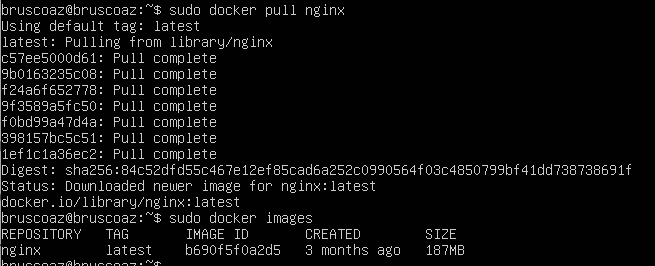
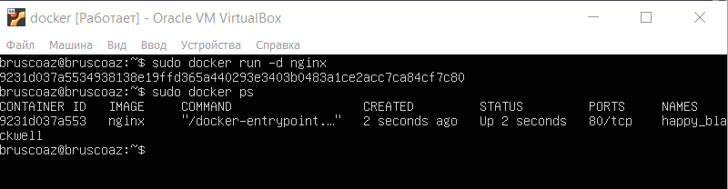
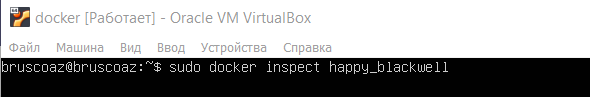
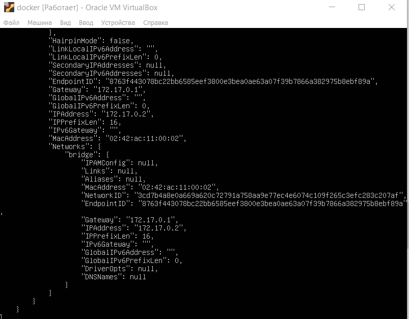

## Part 1. Готовый докер

Для начала нужно установить __docker__, для этого выполним следующие команды:
   `sudo apt update`
   
   `curl -fsSL https://download.docker.com/linux/ubuntu/gpg`
   
   `sudo apt-key add docker.gpg`
   
   `sudo add-apt-repository "deb [arch=amd64] https://download.docker.com/linux/ubuntu focal stable"`
  
   - __focal__ - версия ubuntu(20.04), к примеру 22.04 будет называться __jammy__. 
  
   `sudo apt update` 

   `sudo apt install docker-ce`

После вышеперечисленных команд смотрим статус:
   `sudo systemctl status docker`

##### Возьми официальный докер-образ с **nginx** и выкачай его при помощи `docker pull`.

##### Проверь наличие докер-образа через `docker images`.

Выполним команду `docker pull nginx` и проверим докер-образы командой `docker images`:

##### Запусти докер-образ через `docker run -d [image_id|repository]`.
##### Проверь, что образ запустился через `docker ps`.

Запуск докер-образа и проверка запущенных контейнеров:

__-d__ - запускает контейнер в фоновом режиме и выводит ID контейнера 

##### Посмотри информацию о контейнере через `docker inspect [container_id|container_name]`. По выводу команды определи и помести в отчёт размер контейнера, список замапленных портов и ip контейнера.

Выполнение команды `docker inspect`

 __Информация о ip:__

__Информация о портах:__

__Размер контейнера:__

##### Останови докер образ через `docker stop [container_id|container_name]`. Проверь, что образ остановился через `docker ps`.

Остановка контейнера в помощью команды `docker stop happy_blackwell` и проверка остановки образа командой `docker ps`

##### Запусти докер с портами 80 и 443 в контейнере, замапленными на такие же порты на локальной машине, через команду *run*.

Выполним команду `sudo docker run -d -p 80:80 -p 443:443 nginx`

__-p__ - указывает на привязку портов, где первый число перед двоеточием - это порт на хосте, а второе число после двоеточия - это порт внутри контейнера. 

##### Проверь, что в браузере по адресу *localhost:80* доступна стартовая страница **nginx**.

Проверка стартовой страницы через __lynx__ `lynx localhost:80`:

##### Перезапусти докер контейнер через `docker restart [container_id|container_name]`. Проверь любым способом, что контейнер запустился.

Узнаем __NAMES__ контейнера, по нему выполним рестарт, а затем снова просмотрим список запущенных образов:

## Part 2. Операции с контейнером

##### Прочитай конфигурационный файл *nginx.conf* внутри докер контейнера через команду *exec*.

__docker exec__ - используется для выполнения команд внутри Docker контейнеров.

Выполним команду `sudo docker exec -it serene_wu cat /etc/nginx/nginx.conf `

##### Создай на локальной машине файл *nginx.conf*. Настрой в нем по пути */status* отдачу страницы статуса сервера **nginx**.

Добавляем к дефолтной конфигурации сервера по 80 порту __location /status__ в котором прописываем __stub_status on__ :

##### Скопируй созданный файл *nginx.conf* внутрь докер-образа через команду `docker cp`.

Копируем `nginx.conf` командой `docker cp`:

##### Перезапусти **nginx** внутри докер-образа через команду *exec*. Проверь, что по адресу *localhost:80/status* отдается страничка со статусом сервера **nginx**.

Перезапускаем __nginx__: 

Проверяем статус с помощью команды  `lynx localhost:80/status`:

##### Экспортируй контейнер в файл *container.tar* через команду *export*.

Командой `docker export serene_wu >> container.tar` экспортируем контейнер:

##### Останови контейнер.

Останавливаем контейнер с помощью команды `docker stop serene_wu`:

##### Удали образ через `docker rmi [image_id|repository]`, не удаляя перед этим контейнеры.

##### Удали остановленный контейнер.

##### Импортируй контейнер обратно через команду *import*.

Импортируем контейнер через команду `docker import -c container.tar new_nginx`

##### Запусти импортированный контейнер.

Запускаем импортированный контейнер с помощью команды `docker run`:

##### Проверь, что по адресу *localhost:80/status* отдается страничка со статусом сервера **nginx**.

Проверка ардеса через __curl__:

## Part 3. Мини веб-сервер

##### Напиши мини-сервер на **C** и **FastCgi**, который будет возвращать простейшую страничку с надписью `Hello World!`.

Добавим библиотеку __FastCgi__ с помощью команды `sudo apt-get install libfcgi-dev`

Далее создадим файл __server.c__.

##### Запусти написанный мини-сервер через *spawn-fcgi* на порту 8080.

Установим  __gcc__ и __spawn-fcgi__:

`sudo apt install spawn-fcgi`

`sudo apt install gcc`

Скомпилируем файл командой `gcc my_server.c -o my_server.fcgi -lfcgi`

Теперь запустим сервер на порту 8080:

##### Напиши свой *nginx.conf*, который будет проксировать все запросы с 81 порта на *127.0.0.1:8080*.

Изменим файл __nginx.conf__:

Перезагружаем __nginx__.

##### Проверь, что в браузере по *localhost:81* отдается написанная тобой страничка.

Проверим `localhost:80` через __curl__ и через __lynx__:

## Part 4. Свой докер

#### Напиши свой докер-образ, который:
##### 1) собирает исходники мини сервера на FastCgi из [Части 3](#part-3-мини-веб-сервер);
##### 2) запускает его на 8080 порту;
##### 3) копирует внутрь образа написанный *./nginx/nginx.conf*;
##### 4) запускает **nginx**.

Создадим __Dockerfile__:

##### Собери написанный докер-образ через `docker build` при этом указав имя и тег. Проверь через `docker images`, что все собралось корректно.

Собираем докер-образ с помощью команды `docker . -t fcgi:my_fcgi`:

С помощью команды `docker images` смотрим, что образ сбилдился:

##### Запусти собранный докер-образ с маппингом 81 порта на 80 на локальной машине и маппингом папки *./nginx* внутрь контейнера по адресу, где лежат конфигурационные файлы **nginx**'а (см. [Часть 2](#part-2-операции-с-контейнером)).

##### Проверь, что по localhost:80 доступна страничка написанного мини сервера.

Запуск докер-образа и проверка через __curl__:

##### Допиши в *./nginx/nginx.conf* проксирование странички */status*, по которой надо отдавать статус сервера **nginx**.

Дописываем в конфиг статус:

##### Перезапусти докер-образ. Проверь, что теперь по *localhost:80/status* отдается страничка со статусом **nginx**

Перезапускаем докер-образ и проверяем через __curl__ страничку __localhost:80/status__:

## Part 5. **Dockle**

Дальше я перешел с виртуальной машины на полноценную систему (Ubuntu 22.04).

Установка __Dockle__:
`curl -OL https://github.com/goodwithtech/dockle/releases/download/v0.4.14/dockle_0.4.14_Linux-64bit.tar.gz`

`tar xvf dockle_0.4.14_Linux-64bit.tar.gz`

`sudo mv dockle /usr/local/bin/`

##### Просканируй образ из предыдущего задания через `dockle [image_id|repository]`.

Сканируем с помощью `dockle fcgi:my_fcgi`:

Итого мы имеем 2 ошибки:
1. Ошибка  __Do not store credential in environment variables/files__ - возникает, когда учетные данные хранятся в переменных окружения или файлах. Для исправления данной ошибки можно использовать базовый образ __ubuntu(или debian)__ вместо __nginx__, т.е. в Dockerfile мы пишем `FROM ubuntu`.
 - Предупреждение __Create a user for the container__ - dockle просит использовать юзера, отличного от рута. Чтобы решить данную проблему мы создаем нового пользователя, установка и апдейт будет лежать на рут-пользователе, а дальнейшие действия по типу компиляции, перезапуска __nginx__, будут принадлежать новому пользователю, так же необходимо новому пользователю дать права на определенные папки, которые будут использоваться позже. 
##### Исправь образ так, чтобы при проверке через **dockle** не было ошибок и предупреждений.

Измененный __Dockerfile__:

Проверка на ошибки:

## Part 6. Базовый **Docker Compose**

Установим __Docker Compose__:

`sudo curl -L "https://github.com/docker/compose/releases/download/1.26.0/docker-compose-$(uname -s)-$(uname -m)" -o /usr/local/bin/docker-compose`

`sudo chmod +x /usr/local/bin/docker-compose`

##### Напиши файл *docker-compose.yml*, с помощью которого:
##### 1) Подними докер-контейнер из [Части 5](#part-5-инструмент-dockle) (он должен работать в локальной сети, т.е. не нужно использовать инструкцию **EXPOSE** и мапить порты на локальную машину).
##### 2) Подними докер-контейнер с **nginx**, который будет проксировать все запросы с 8080 порта на 81 порт первого контейнера.
##### Замапь 8080 порт второго контейнера на 80 порт локальной машины.

Содержимое *docker-compose.yml*:

- __version__ - файл docker-compose должен начинаться с тега версии;
- __services__ — основной раздел, где мы будем создавать и описывать наши сервисы (контейнеры docker);
- __build__ - указание на необходимость сборки из Dockerfile;
- __image__ - имя образа, который будет использоваться для создания контейнера;
- __volumes__ - осуществляет проброс папок;
- __ports__ - с помощью данной опции мы можем указывать, на каких портах должен слушать контейнер и на какие порты должны пробрасываться запросы;
- __depends_on__ - мы можем указать от какого контейнера зависит сервис:

Содержимое __nginx.conf__ для proxy:

- __proxy_pass__ - директива используется для перенаправления запросов к другому серверу. Здесь все запросы, пришедшие к этому блоку location, будут перенаправлены на сервер с именем server порт 81.

##### Останови все запущенные контейнеры.

Проверим, что все контейнеры остановлены:

##### Собери и запусти проект с помощью команд `docker-compose build` и `docker-compose up`.

Выполним билд:

##### Проверь, что в браузере по *localhost:80* отдается написанная тобой страничка, как и ранее.

Проверим через `curl localhost:80`:

